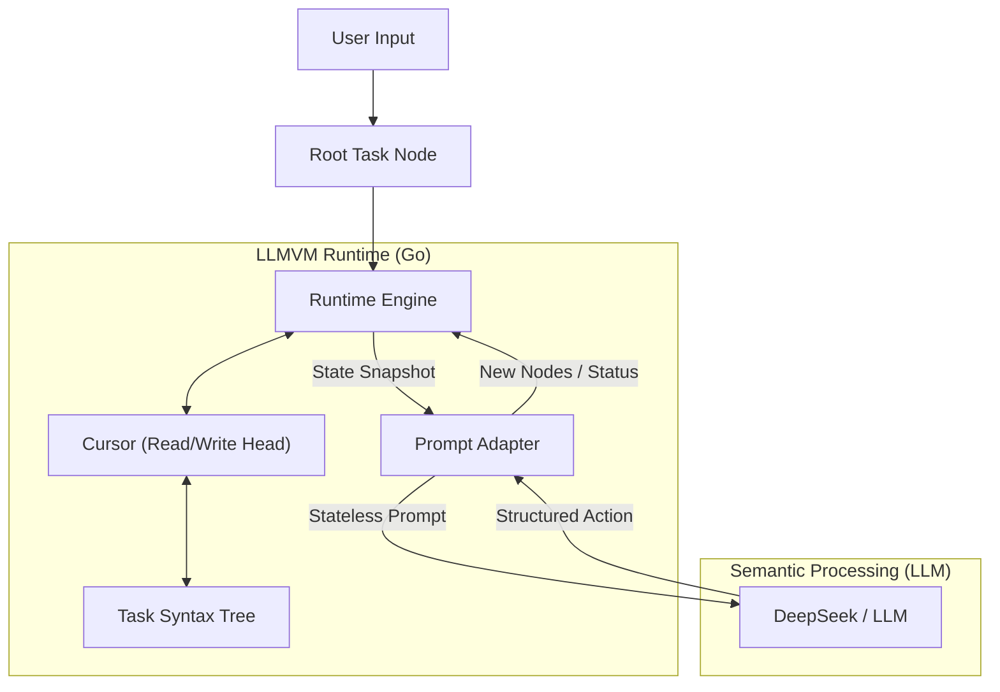

# LLMVM (LLM Virtual Machine)

**LLMVM** is a Turing-Complete Agent Runtime that fundamentally reimagines how Large Language Models (LLMs) execute complex tasks. Instead of the traditional "Chain of Thought" loop, LLMVM acts as a semantic state machine that dynamically constructs and executes a dedicated Program Syntax Tree (AST) for each task.

## 🚀 Key Highlights

*   **True Turing Completeness**: Unlike standard Agents that rely on probabilistic loops, LLMVM implements explicit control flow structures.
    *   **Loop Nodes**: Managed by a dedicated runtime stack, ensuring cyclic logic is executed faithfully until exit conditions are met.
    *   **DFS Execution**: Uses Depth-First Search for task execution, mimicking the call stack of a compiled program rather than a flat list of actions.

*   **Stateless Architecture**: Solves the "Context Window Explosion" problem by never feeding the entire conversation history to the model. At each step, the LLM receives only a precise snapshot of the current state.

*   **Global Attention (v4)**: A ranked "full-tree scan" mechanism that prioritized recently completed node results from across the entire AST, providing a global "RAM" regardless of the current DFS path.

*   **Physical File Operations (v2)**: Built-in `execute_command` action with a real VFS, supporting `ls`, `cat`, `write`, and `rm` on the host system.

*   **Scoped Node Variables**: Distributed memory that follows the DFS lifecycle, preventing context pollution while maintaining path-specific state.

*   **Context-Aware Leaf Nodes**: Redefines "Leaf Nodes" as tasks small enough to fit perfectly within the LLM's optimal context window, ensuring high-quality reasoning through proactive decomposition.

*   **Autonomous Self-Correction (Robustness)**:
    *   **Try-Catch Mechanism**: Built-in retry loop (default 3 retries) for parsing or execution failures.
    *   **Error Feedback**: Runtime automatically captures errors and feeds them back to the LLM to guide self-correction.

*   **Bootstrapped JIT Logic**: The program isn't pre-written; it's compiled *Just-In-Time* by the LLM (acting as the ALU) and executed by the Go runtime (acting as the CPU).

## 🛠 Architecture

LLMVM separates **Logic (Control Flow)** from **Semantics (Intelligence)**.



1.  **TaskTree**: A dynamic tree structure representing the program state. Nodes can be `Normal`, `Loop`, or `Leaf`.
2.  **Cursor**: Tracks the current execution point, managing traversal and loop stacks.
3.  **Stateless Prompting**: The Runtime constructs a JSON-structured snapshot of the current node and its immediate neighbors.

## 📦 Installation

```bash
git clone https://github.com/Steve65535/llmvm.git
cd llmvm
go mod download
```

### 🔑 Environment Variables
You must set your DeepSeek API key to use the live engine:
```bash
export DEEPSEEK_API_KEY="your_api_key_here"
```

## ⚡ Usage

Run the VM with a natural language command:

```bash
go run cmd/main.go "Analyze this project's code structure and highlight key architectural patterns"
```

Or enter interactive mode:

```bash
go run cmd/main.go
# Then type your command at the prompt
```

## 📂 Project Structure

*   `cmd/`: CLI Entry point.
*   `pkg/runtime/`: The core VM engine (The "CPU").
*   `pkg/cursor/`: Pointer logic and Stack management.
*   `pkg/tasknode/`: The data structure for the AST (The "Memory").
*   `pkg/llm/`: Interface adapters for LLMs (The "ALU").

## 📄 License

MIT
