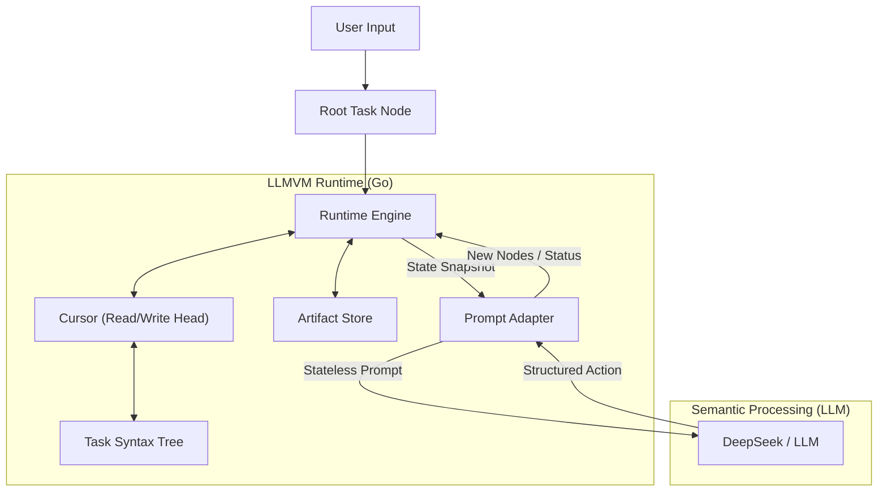

# LLMVM (LLM Virtual Machine)

**LLMVM** is an advanced Agent Runtime that fundamentally reimagines how Large Language Models (LLMs) execute complex tasks. Instead of the traditional "Chain of Thought" loop, LLMVM acts as a semantic state machine that dynamically constructs and executes a dedicated Program Syntax Tree (AST) for each task.

## 🚀 Key Highlights

*   **Explicit Control Flow**: Unlike standard Agents that rely on probabilistic loops, LLMVM implements explicit control flow structures.
    *   **Loop Nodes**: Managed by a dedicated runtime stack, ensuring cyclic logic is executed faithfully until exit conditions are met.
    *   **DFS Execution**: Uses Depth-First Search for task execution, mimicking the call stack of a compiled program rather than a flat list of actions.

*   **Stateless Architecture**: Solves the "Context Window Explosion" problem by never feeding the entire conversation history to the model. At each step, the LLM receives only a precise snapshot of the current state.

*   **Artifact-Based Memory System**: A structured information management layer that replaces raw variable dumping.
    *   **Stable IDs**: Every tool result (file reads, searches, command outputs) is stored as an artifact with a globally unique ID (`art_1`, `art_2`, ...).
    *   **Summaries, Not Full Text**: Variables only hold artifact references. The LLM sees summaries in the prompt and uses `read_artifact` for on-demand slice access.
    *   **LRU Eviction + Disk Spill**: Store holds up to 50 active artifacts. Large objects (>8KB) spill to disk. Evicted artifacts retain their summary as tombstones.
    *   **Pin Protection**: Important artifacts can be pinned to survive eviction.

*   **Structured Node Handoff**: Every completed node produces a structured report:
    *   `summary`: What was accomplished
    *   `key_facts`: Key findings as a bullet list
    *   `artifact_refs`: Referenced artifact IDs
    *   `handoff`: One-line guidance for downstream nodes
    *   Runtime auto-generates operation logs as fallback if the LLM omits these fields.

*   **Budget-Controlled Global Context**: Runtime auto-assembles context with hard character limits:
    *   Tree index with result summaries (3K chars)
    *   Artifact index (2K chars, 20 entries max)
    *   Sibling handoffs (1K chars)
    *   Replaces the old `selectAttentionNodes` LLM call — zero extra API calls.

*   **Infinite Continuous Reasoning**: No hard iteration limit. Stagnation detection (3× identical responses) is the only safety valve, allowing arbitrarily long task chains.

*   **Context Overflow Recovery**: When the API returns a context overflow error, the runtime progressively compresses the prompt through 4 levels (trim global context → trim history → strip all ephemeral variables) before falling back to retry limits.

*   **Runtime-Enforced Sandbox**: All file operations (`read_file`, `write_file`, `list_dir`, `search`, `append_to_file`) are validated at runtime to stay within `test/sandbox/`. Uses separator-aware path checking to prevent prefix bypass attacks.

*   **Structured File Tools**: Six dedicated tools beyond raw shell execution:

    | Tool | Description |
    |---|---|
    | `read_file` | Read file → artifact |
    | `write_file` | Create/overwrite file |
    | `list_dir` | List directory → artifact |
    | `search` | Recursive grep → artifact (distinguishes no-match vs error) |
    | `append_to_file` | Incremental file building |
    | `read_artifact` | Slice-based artifact access (default 50 lines) |

*   **Full Shell Injection**: Real shell execution (`sh -c`) with piping, redirection, and access to all host utilities.

*   **State Persistence**: Full task tree + artifact store serialize to JSON. Supports `--save` / `--load` for resuming execution. Auto-saves on each step and on Ctrl+C. Spill files are validated on restore; missing ones gracefully degrade to tombstones.

*   **Autonomous Self-Correction**:
    *   **Stagnation Detection**: Identical responses trigger escalating intervention (warning → forced strategy change → node failure).
    *   **Error Feedback**: Runtime captures errors and feeds them back to the LLM for self-correction.
    *   **Error Handlers**: Nodes can specify `error_handler_node` for structured error recovery.

*   **Bootstrapped JIT Logic**: The program isn't pre-written; it's compiled *Just-In-Time* by the LLM (acting as the ALU) and executed by the Go runtime (acting as the CPU).

## 🛠 Architecture

LLMVM separates **Logic (Control Flow)** from **Semantics (Intelligence)**.



1.  **TaskTree**: A dynamic tree structure representing the program state. Nodes can be `Normal`, `Loop`, or `Leaf`.
2.  **Cursor**: Tracks the current execution point, managing traversal and loop stacks.
3.  **Artifact Store**: Manages tool results as stable-ID objects with summaries, eviction, and disk spill.
4.  **Stateless Prompting**: The Runtime constructs a JSON-structured snapshot of the current node, global context (tree index + artifact index + sibling handoffs), and scoped variables.

## 📦 Installation

```bash
git clone https://github.com/Steve65535/llmvm.git
cd llmvm
go mod download
```

### 🔑 Environment Variables
You must set your DeepSeek API key to use the live engine:
```bash
export DEEPSEEK_API_KEY="your_api_key_here"
```

## ⚡ Usage

Run the VM with a natural language command:

```bash
go run cmd/main.go "Analyze this project's code structure and highlight key architectural patterns"
```

Or enter interactive mode:

```bash
go run cmd/main.go
# Then type your command at the prompt
```

Save and resume execution:

```bash
# Save state after each step
go run cmd/main.go --save state.json "your complex task"

# Resume from saved state
go run cmd/main.go --load state.json
```

## 📂 Project Structure

*   `cmd/`: CLI entry point with save/load support.
*   `pkg/runtime/`: The core VM engine (The "CPU") — execution loop, global context assembly, sandbox enforcement, context compression.
*   `pkg/cursor/`: Pointer logic and stack management.
*   `pkg/tasknode/`: The data structure for the AST (The "Memory") — includes structured handoff fields.
*   `pkg/llm/`: Interface adapters for LLMs (The "ALU") — system prompt, action parsing, response validation.
*   `pkg/artifact/`: Artifact Store — stable-ID information objects with LRU eviction, disk spill, and slice-based access.
*   `pkg/vfs/`: Virtual filesystem (legacy).
*   `visualizer/`: Tree visualization web server.

## 🧪 Testing

```bash
# All tests
go test ./...

# LLM parser tests
go test ./pkg/llm/ -v

# Artifact store tests (add, slice, eviction, pin, spill, index)
go test ./pkg/artifact/ -v
```

## 📄 License

MIT
