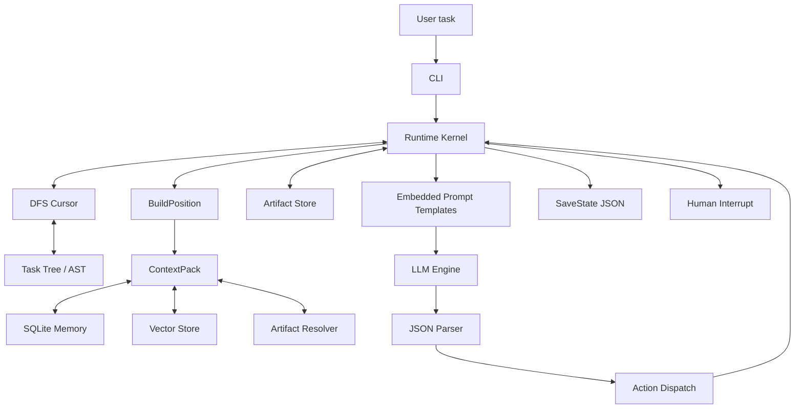

# LLMVM

**LLMVM is a position-aware, artifact-backed, acceptance-driven virtual machine for LLM-generated task programs.**

It is not a chatbot loop with more tools. It is a Go runtime that executes long-running LLM tasks as a recoverable task tree. The model proposes structured actions; the runtime owns control flow, state, evidence, permissions, retrieval, and completion.

> Treat the LLM context window like CPU registers, not disk. Each model call receives only the minimum useful state for the current execution position. Durable state lives in the task tree, artifacts, and rebuildable indexes.

## The Idea

Most agents run as a single growing conversation:

```text
user goal -> model -> tool -> observation -> append to history -> model -> ...
```

LLMVM runs as a virtual machine:

```text
fetch current node
  -> build position
  -> assemble context pack
  -> call LLM as semantic ALU
  -> parse JSON action DSL
  -> validate authority and schema
  -> execute action
  -> commit state and artifacts
  -> move cursor
```

The difference is architectural. In LLMVM, state is not hidden inside chat history. State is explicit, serializable, inspectable, and recoverable.

## VM Mapping

| Virtual machine concept | LLMVM component |
|---|---|
| Program | Task Tree / AST |
| Instruction pointer | DFS Cursor |
| Runtime / CPU | `pkg/runtime` |
| Semantic ALU | LLM Engine |
| Instruction set | JSON Action DSL |
| Registers | Prompt snapshot for current node |
| Memory | TaskNode variables and handoffs |
| Evidence store | Artifact Store |
| Query index | SQLite Memory + Vector Store |
| Interrupt | Human-in-the-loop |
| Permission ring | Position Authority |
| Completion contract | Acceptance Criteria / Results |
| Persistent image | SaveState JSON |
| Debug view | Visualizer / future TUI |

## Execution Model

LLMVM constructs the task program just-in-time. The root node starts with the user request. The model can create child nodes, append sibling nodes, produce artifacts, query memory, request context, call tools, and mark nodes complete.

The runtime is the authority:

```text
LLM proposes structure
Runtime owns structure
Cursor executes structure
Artifacts preserve evidence
Memory indexes evidence
Acceptance verifies completion
Handoff connects nodes
```

The current execution flow is:

```text
CLI start / load state
  -> NewRuntime
  -> Execute loop
    -> current cursor node
    -> BuildPosition
    -> BuildContextPack
    -> build prompt from embedded markdown templates
    -> LLM call
    -> ParseResponse
    -> CheckAuthority
    -> ExecuteAction dispatch
    -> write TaskTree / Artifact / SQLite / Vector
    -> decideNextStep
    -> autosave hook
```

## Core Mechanisms

### Task Tree as Program

The task tree is the control-flow authority. Nodes carry:

- Type: `Normal` or `Leaf`.
- Status: pending, running, completed, failed, or waiting for human input.
- Scoped variables.
- Structured handoff fields.
- Artifact references.
- Acceptance criteria and results.
- Parent/child relationships restored after JSON load.

`Normal` nodes plan and coordinate. `Leaf` nodes execute atomic work and may enter an agentic refinement loop until completion criteria are met.

### Position Engineering

A node does not receive a generic prompt. It receives a prompt built from its position in the task tree.

`BuildPosition` derives:

- Node ID, parent ID, depth, path, and sibling index.
- Role: `root`, `planner`, `executor`, or `error_handler`.
- Scope: what context should normally be visible.
- Authority: which actions this position may emit.
- Constraints: local rules such as required acceptance criteria.

The runtime injects `## Position` and `## Allowed Actions` into the prompt, then enforces the same policy in `CheckAuthority` before executing any action.

### Context Pack

Context is assembled by the runtime, not remembered by the model.

The current pipeline is:

```text
BuildPosition
  -> buildNodeActivation
  -> retrieval.Query
  -> resolver.Resolve for large artifacts
  -> format ContextPack
```

`NodeActivation` contributes deterministic context:

- Hierarchy path.
- Parent goal.
- Sibling handoffs.
- Available artifact index.
- Open questions.
- Tree index.

`retrieval.Service` adds hybrid retrieval:

- SQLite metadata filters.
- SQLite FTS.
- Vector search through chromem-go when available.
- Deterministic merge and rerank.
- Retrieval event and rerank trace logging.

`resolver.Resolver` handles large artifacts by extracting evidence spans instead of putting the full content into the main prompt.

### Artifact-Backed Memory

Tool results and reusable evidence become artifacts:

```text
tool output -> artifact -> artifact ID -> variables / handoff / retrieval index
```

Artifacts have stable IDs, summaries, source metadata, scope, tags, granularity, importance, versions, supersession links, pinning, token counts, and spill-to-disk behavior.

The DSL also supports first-class artifact actions:

- `add_artifact`: create a reusable evidence unit.
- `modify_artifact`: append a new version and mark the old artifact as superseded.
- `read_artifact`: inspect a slice without loading the whole object.

Variables and handoffs should reference artifact IDs rather than copying large content.

### SQLite and Vector Indexes

The task tree is the source of truth. SQLite and vector indexes are rebuildable retrieval mirrors.

SQLite indexes:

- Nodes.
- Handoffs.
- Scoped variables.
- Artifacts and FTS records.
- Acceptance criteria and results.
- Retrieval/rerank events.

Vector storage is optional. If it is unavailable, retrieval falls back to FTS. If SQLite is unavailable, the runtime degrades instead of losing the task tree.

### JSON Action DSL

The model returns one JSON object:

```json
{
  "actions": [
    {
      "action_type": "create_node",
      "node": {
        "id": "inspect_runtime",
        "name": "Inspect Runtime",
        "type": "Leaf",
        "information": "Read pkg/runtime and summarize the execution loop"
      }
    }
  ]
}
```

The runtime parses, validates, authority-checks, and dispatches actions. `ExecuteAction` is intentionally a Go switch-based DSL interpreter: easy to inspect, easy to test, and strict at the side-effect boundary.

Supported action families include:

- Tree mutation: `create_node`, `append_sibling_node`, `mark_complete`.
- State update: `update_variables`.
- Tools: `execute_command`, `read_file`, `write_file`, `append_to_file`, `list_dir`, `search`.
- Artifacts: `add_artifact`, `modify_artifact`, `read_artifact`.
- Retrieval: `query_memory`, `request_context`.
- Human interaction: `request_human_input`.
- Control: `shutdown`.

### Acceptance-Driven Completion

Loop nodes have been removed from the DSL. Iteration is expressed through acceptance criteria and retry budgets.

A node may define criteria:

```json
{
  "description": "go test ./pkg/llm passes",
  "required": true,
  "check_type": "testable",
  "check_command": "go test ./pkg/llm"
}
```

To complete, the model must provide `acceptance_results`. For `testable` checks, the runtime executes the command and overrides the model's self-report if the real exit code disagrees.

Completion is therefore:

```text
model proposes completion
  -> runtime verifies required acceptance
  -> handoff is written
  -> artifacts are pinned/indexed
  -> cursor moves on
```

### Human-in-the-Loop

`request_human_input` is a runtime interrupt:

```text
request_human_input
  -> node.Status = WaitingHuman
  -> state is saved
  -> user resumes with --resume <node-id>
  -> human response is injected
  -> execution continues
```

This makes human intervention durable rather than an ephemeral terminal prompt.

## Runtime Package Layout

`pkg/runtime` is intentionally split around one `Runtime` object:

| File | Responsibility |
|---|---|
| `runtime.go` | `Runtime` struct, `NewRuntime`, lifecycle helpers |
| `execute.go` | Main DFS execution loop, retry, stagnation, cursor movement |
| `dispatch.go` | Action DSL dispatch and core handlers |
| `position.go` | Position, role, scope, authority policy |
| `activation.go` | NodeActivation and ContextPack pipeline |
| `context_assembly.go` | Global context, tree index, workspace compatibility |
| `prompt.go` | Prompt construction from runtime state |
| `prompt_template.go` | Embedded node prompt template |
| `index.go` | SQLite rebuild/sync and vector indexing |
| `shell.go` | Shell execution and file-tool sandbox checks |
| `actions.go` | Special actions: human input, memory, artifacts, context, acceptance |
| `agentic_loop.go` | Leaf refinement loop |
| `budget.go` | Context and retrieval budget config |
| `tokens.go` | Token estimate, compression, operation-log fallback |

This keeps `runtime.go` as the composition root, while execution behavior lives in focused files.

## Architecture


<details>
<summary>Mermaid source</summary>


```mermaid
graph TD
    User["User task"] --> CLI["CLI"]
    CLI --> Runtime["Runtime Kernel"]

    Runtime <--> Cursor["DFS Cursor"]
    Cursor <--> Tree["Task Tree / AST"]

    Runtime --> Position["BuildPosition"]
    Position --> ContextPack["ContextPack"]
    ContextPack <--> Memory["SQLite Memory"]
    ContextPack <--> Vector["Vector Store"]
    ContextPack <--> Resolver["Artifact Resolver"]

    Runtime <--> Artifacts["Artifact Store"]
    Runtime --> Prompt["Embedded Prompt Templates"]
    Prompt --> LLM["LLM Engine"]
    LLM --> Parser["JSON Parser"]
    Parser --> Dispatch["Action Dispatch"]
    Dispatch --> Runtime

    Runtime --> Save["SaveState JSON"]
    Runtime --> Human["Human Interrupt"]
```

</details>

## Project Structure

- `cmd/`: CLI orchestration, engine selection, state load/save, signals, human resume, final tree print.
- `pkg/runtime/`: VM kernel, execution loop, context assembly, action dispatch, authority checks, indexing, sandboxing.
- `pkg/llm/`: LLM provider wrapper, embedded system prompt, action DTOs, JSON parser.
- `pkg/tasknode/`: Task tree model, structured handoff, acceptance state, human request/response state.
- `pkg/cursor/`: DFS cursor and traversal state.
- `pkg/artifact/`: Artifact store, slicing, spill, pinning, structured metadata.
- `pkg/memory/`: SQLite schema, indexing, constrained queries, FTS, retrieval traces.
- `pkg/retrieval/`: Hybrid FTS/vector retrieval and deterministic rerank.
- `pkg/vector/`: Optional chromem-go vector index.
- `pkg/resolver/`: Large-artifact evidence extraction.
- `pkg/vfs/`: Legacy virtual filesystem code.
- `visualizer/`: Saved-state visualization server and frontend.
- `markdown/`: Design notes and architecture experiments.

## Configuration

| Variable | Default | Description |
|---|---:|---|
| `DEEPSEEK_API_KEY` | unset | DeepSeek API key. If unset, the CLI falls back to `StubEngine`. |
| `LLMVM_CONTEXT_TOKEN_LIMIT` | `200000` | Total prompt budget used by the current runtime. |
| `CONTEXT_BUDGET` | fallback alias | Backward-compatible alias for the context limit. |
| `LLMVM_RETRIEVAL_TOKEN_LIMIT` | half of context limit | Budget for retrieval candidates. |
| `LLMVM_ARTIFACT_INLINE_TOKEN_LIMIT` | `6000` | Inline/resolver evidence budget for large artifacts. |
| `LLMVM_ARTIFACT_ASYNC_TOKEN_THRESHOLD` | `12000` | Reserved threshold for async artifact resolver behavior. |
| `LLMVM_COMMAND_RESULT_CHARS` | `8000` | Max chars surfaced from command/artifact slices. |
| `LLMVM_VECTOR_DIR` | derived from save path | Optional chromem-go vector store directory. |

## Usage

Install dependencies:

```bash
go mod download
```

Run a task:

```bash
go run cmd/main.go "Analyze this repository and summarize its architecture"
```

Run interactively:

```bash
go run cmd/main.go
```

Save and resume:

```bash
go run cmd/main.go --save state.json "Run a complex task"
go run cmd/main.go --load state.json
```

Resume a waiting human-input node:

```bash
go run cmd/main.go --load state.json --resume node_id
```

Run the visualizer:

```bash
cd visualizer
go run server.go -file ../deep_compiler.json
```

Run the frontend:

```bash
cd visualizer/frontend
npm run dev
```

## Development

Run all Go tests:

```bash
go test ./...
```

Focused checks:

```bash
go test ./pkg/llm -v
go test ./pkg/runtime -v
go test ./pkg/artifact -v
go test ./pkg/memory -v
```

Frontend checks:

```bash
cd visualizer/frontend
npm run lint
npm run build
```

## Design Status

Implemented or partially implemented:

- Task tree execution.
- Position and authority checks.
- Embedded prompt templates.
- Artifact store with structured metadata.
- SQLite memory and FTS.
- Optional vector retrieval.
- ContextPack pipeline.
- Large-artifact resolver.
- Acceptance criteria and runtime testable checks.
- Human-in-the-loop pause/resume.
- Save/load state.

Still evolving:

- More precise parser diagnostics.
- Cleaner budget ownership inside ContextPack.
- Stronger ContextProvider abstractions.
- More complete acceptance semantics for manual and LLM-judge checks.
- TUI cockpit.
- Provider-level JSON/schema output constraints.

## License

MIT
