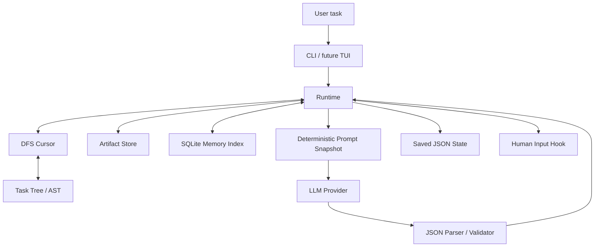

# LLMVM

LLMVM is an experimental Go runtime for executing long-running LLM tasks as a recoverable task tree instead of a single growing chat transcript.

The core idea is simple: treat the model call as a stateless decision step, and keep durable execution state in a runtime-owned structure. The task tree is the source of truth for control flow; artifacts and memory indexes provide evidence retrieval; prompts are rebuilt from the current node position on every step.

> The LLM context window is treated like CPU registers, not disk. Each call receives the minimum useful state for the current position, while durable state lives in the task tree, artifacts, and rebuildable indexes.

## Why LLMVM Exists

Most agent loops accumulate conversation history until the context becomes expensive, noisy, or impossible to resume faithfully. LLMVM takes a different route:

- The runtime owns control flow through an explicit task tree.
- The model returns structured actions, not hidden control state.
- Tool results are stored as artifacts with stable IDs.
- SQLite memory is a queryable index, not the authority.
- Saved JSON state can restore the execution tree and artifact metadata.
- Human input is a first-class pause/resume state.

This makes LLMVM closer to a virtual machine for task execution than a chatbot wrapper.

## Current Capabilities

### Explicit Task Tree Execution

Tasks are represented as `TaskNode` objects and traversed by a DFS cursor. Nodes carry type, status, scoped variables, structured handoff fields, artifact references, and parent/child relationships.

The AST is authoritative. SQLite memory, prompt snapshots, and visualization data are derived from it.

### Stateless Runtime Calls

Each model call is built from a deterministic snapshot:

- Current node and objective.
- Ancestor path and parent goal.
- Sibling handoffs and open questions.
- Scoped variables.
- Artifact summaries and selected retrieval results.
- Runtime state such as retry/error context.

The runtime does not depend on an ever-growing chat transcript. This is the foundation for resume, compaction, and long task execution.

### Structured Actions

The model communicates through a validated JSON action protocol. The parser and runtime validate actions instead of relying only on prompt instructions.

Core actions include node creation/completion, file tools, artifact reads, memory queries, shell execution, sibling appends, and human input requests.

When changing action behavior, the full contract must stay aligned across:

- `pkg/llm/api.go` for prompt/action documentation.
- `pkg/llm/parser.go` for DTOs and validation.
- `pkg/runtime/` for execution behavior.
- `pkg/tasknode/`, `pkg/artifact/`, or `pkg/memory/` when state must persist.

### Artifact Store

Tool outputs and large reusable evidence are stored as artifacts instead of being copied into variables or prompts.

Artifacts provide:

- Stable IDs such as `art_1`, `art_2`, and `art_3`.
- Summaries for compact prompt display.
- Slice-based reads through `read_artifact`.
- Pinning for important artifacts.
- LRU-style active storage behavior.
- Disk spill for large content.
- Tombstone metadata when content is unavailable after restore.

Variables and handoffs should reference artifact IDs rather than embedding large content.

### SQLite Structured Memory

`pkg/memory/` maintains a SQLite-backed retrieval index over runtime state:

- Nodes.
- Structured handoffs.
- Scoped variables.
- Artifact metadata.
- Full-text searchable artifact records.

The task tree remains the authority. SQLite is rebuildable and exists to make retrieval deterministic, inspectable, and cheap. The model can query it through constrained `query_memory` modes such as ancestor chains, sibling handoffs, recent artifacts, pinned artifacts, and FTS artifact search.

### Structured Handoffs

Completed nodes can produce a structured handoff:

```json
{
  "summary": "What was completed",
  "key_facts": ["Important facts discovered"],
  "decisions": ["Important choices made"],
  "assumptions": ["Unverified assumptions"],
  "outputs": ["Files, values, or state produced"],
  "open_questions": ["Issues downstream nodes should know"],
  "artifact_refs": ["art_2", "art_5"],
  "handoff": "One-line downstream guidance",
  "confidence": "high"
}
```

This gives downstream nodes a compact, typed contract instead of forcing them to infer progress from raw history.

### Runtime Safeguards

LLMVM includes runtime-level safeguards:

- File tool sandboxing under `test/sandbox/`.
- Separator-aware path validation.
- Error feedback to the model.
- Stagnation detection for repeated identical responses.
- Context overflow recovery through progressive compression.
- Save/load state persistence.
- Ctrl+C save behavior when configured.
- Human-in-the-loop pause and resume through `WaitingHuman`.

Shell execution is intentionally broader than file tools. Treat it as powerful host access and keep that distinction explicit.

## Position Engineering

The main architectural direction in `markdown/position_engineering_deep_refactor.md` is to promote "position" into a first-class runtime concept.

Position engineering means that a node should not merely receive a generic context bundle. It should understand:

- Where it is in the task tree.
- What role it has at that position.
- What scope it is responsible for.
- Which actions it is allowed to take.
- Which evidence it should retrieve.
- What handoff it must produce.

In other words:

```text
Position -> Context Needs -> Retrieval Plan -> Context Pack -> Decision -> Handoff
```

The planned runtime vocabulary is:

- `Position`: node ID, parent, depth, path, sibling index, role, scope, authority, constraints.
- `ContextNeed`: what this position needs to know.
- `ContextPlan`: which providers to query and with what budget.
- `ContextProvider`: memory, artifact, tree state, runtime state, VFS, future vector stores.
- `ContextPack`: sorted, deduplicated, compressed, budgeted context for the model call.
- `AuthorityDescriptor`: runtime-enforced action permissions for this position.

The current code already has pieces of this through node activation, structured memory, artifacts, and handoffs. The next step is to make position policy explicit instead of leaving it spread across prompt text and helper functions.

## RAG and Artifact Roadmap

`markdown/rag_artifact_position_engineering_experiment.md` sketches a higher-risk architecture experiment: moving from "task tree plus prompt assembly" toward "task tree plus artifact handoff, retrievable memory, and acceptance-driven nodes."

Planned directions include:

- Make artifacts a first-class DSL object through an `add_artifact` action.
- Store fine-grained artifact metadata in SQLite and, later, a vector index.
- Add hybrid retrieval: metadata filters, SQLite FTS, vector search, merge, rerank, context-pack building.
- Replace fixed context percentages with a global token limit and relevance-driven packing.
- Add large-artifact resolvers that extract only the evidence needed by the current node.
- Introduce acceptance criteria and acceptance results for node completion.
- Eventually deprecate structural loop nodes in favor of retry budgets plus explicit acceptance checks.
- Strengthen JSON output handling with extraction, schema validation, typed parse errors, and provider-level JSON/schema modes where available.

This roadmap is intentionally separated from current implementation status. It describes where the runtime is heading, not all features that are already complete.

## Terminal UI Roadmap

`markdown/terminal_ui_plan.md` proposes a TUI for making long-running executions observable and interruptible.

The planned TUI is a developer cockpit for:

- Starting tasks.
- Watching the current cursor position.
- Inspecting the AST.
- Reading artifact summaries and slices.
- Viewing memory query results.
- Responding to human-input requests.
- Tracking retries, context compression, errors, and save/load state.

The recommended stack is Go-native: Bubble Tea, Bubbles, Lip Gloss, and Glamour. The TUI is planned as an addition to the existing CLI, not a replacement.

## Architecture


```mermaid
graph TD
    User["User task"] --> CLI["CLI / future TUI"]
    CLI --> Runtime["Runtime"]

    Runtime <--> Cursor["DFS Cursor"]
    Cursor <--> Tree["Task Tree / AST"]
    Runtime <--> Artifacts["Artifact Store"]
    Runtime <--> Memory["SQLite Memory Index"]
    Runtime --> Prompt["Deterministic Prompt Snapshot"]

    Prompt --> LLM["LLM Provider"]
    LLM --> Parser["JSON Parser / Validator"]
    Parser --> Runtime

    Runtime --> State["Saved JSON State"]
    Runtime --> Human["Human Input Hook"]
```

Key packages:

- `cmd/`: CLI entry point, flags, save/load, runtime bootstrap.
- `pkg/runtime/`: execution loop, prompt construction, action execution, sandbox enforcement, context handling, memory synchronization.
- `pkg/llm/`: provider API types, system prompt, parser, validation, engine wrappers.
- `pkg/tasknode/`: task tree model, node status, variables, handoffs, human request/response payloads, restore helpers.
- `pkg/cursor/`: DFS traversal and loop-related cursor state.
- `pkg/artifact/`: artifact store, summaries, slicing, eviction, pinning, disk spill.
- `pkg/memory/`: SQLite index and constrained retrieval queries.
- `pkg/vfs/`: legacy virtual filesystem code.
- `visualizer/`: Go visualization server.
- `visualizer/frontend/`: Vite + React frontend for inspecting saved runtime state.
- `markdown/`: design notes and experimental architecture documents. This directory is currently gitignored.

## Installation

```bash
git clone https://github.com/Steve65535/llmvm.git
cd llmvm
go mod download
```

## Configuration

| Variable | Default | Description |
|---|---:|---|
| `DEEPSEEK_API_KEY` | unset | DeepSeek API key for live model calls. If unset, use the available stub/test flow. |
| `CONTEXT_BUDGET` | `64000` | Total context budget used by current runtime prompt assembly. |

Planned TUI and retrieval experiments may introduce additional `LLMVM_*` variables. See the design documents in `markdown/` for proposed names.

## Usage

Run a task:

```bash
go run cmd/main.go "Analyze this repository and summarize its architecture"
```

Run in interactive mode:

```bash
go run cmd/main.go
```

Save and resume:

```bash
go run cmd/main.go --save state.json "Run a complex task"
go run cmd/main.go --load state.json
```

Run the visualizer server against a saved state:

```bash
cd visualizer
go run server.go -file ../deep_compiler.json
```

Run the visualizer frontend:

```bash
cd visualizer/frontend
npm run dev
```

## Development

Run all Go tests:

```bash
go test ./...
```

Run focused tests:

```bash
go test ./pkg/llm -v
go test ./pkg/runtime -v
go test ./pkg/artifact -v
go test ./pkg/memory -v
```

Run frontend checks:

```bash
cd visualizer/frontend
npm run lint
npm run build
```

Use `gofmt` for Go files. Keep behavior deterministic: stable ordering matters for prompt cache behavior, reproducible tests, saved state, and visualizer output.

## Design Principles

- The task tree is the authority for execution state.
- SQLite memory is a rebuildable retrieval index.
- Artifacts carry evidence; variables and handoffs carry references.
- Runtime validation is required at parser and action execution boundaries.
- Context should be selected by position, relevance, and budget, not by chat history inertia.
- Long-running tasks must be observable, resumable, and inspectable.
- Future RAG/vector features should be added behind interfaces, not hard-wired into runtime control flow.

## License

MIT
