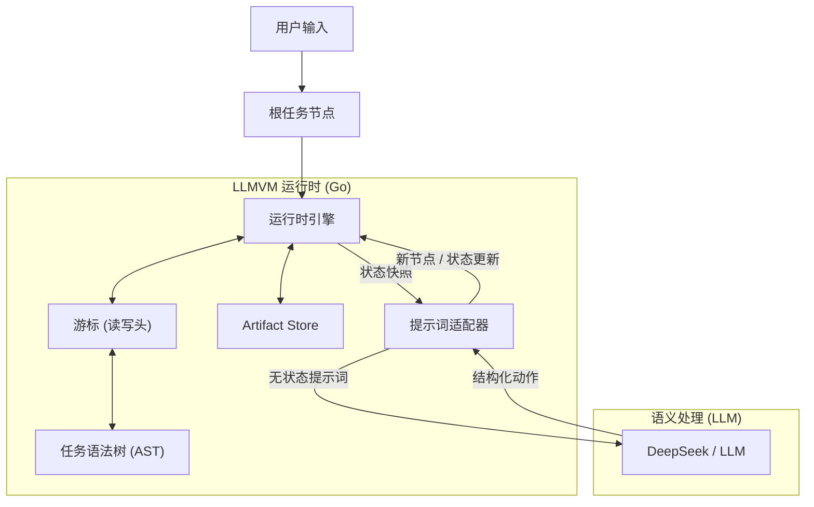

# LLMVM（LLM 虚拟机）

**LLMVM** 是一个先进的 Agent 运行时，从根本上重新定义了大语言模型（LLM）执行复杂任务的方式。它不使用传统的"思维链"循环，而是作为语义状态机，为每个任务动态构建并执行专用的程序语法树（AST）。

## 核心理念

> 把 LLM 的上下文窗口当作 CPU 的寄存器，而不是磁盘。
> 每次只加载当前指令所需的数据，执行完清空，状态持久化在 AST 里而不是对话历史里。

## 与 Claude Code / Codex 的本质区别

| 维度 | LLMVM | Claude Code / Codex |
|---|---|---|
| 计算模型 | LLM 作为 ALU（无状态快照 → action） | LLM 作为 Agent（持续上下文累积） |
| 上下文增长 | O(1)，每次调用固定大小 | O(n)，随步骤线性增长 |
| 任务规划 | 显式 AST，可持久化/可视化 | 隐式，在 LLM 内部 |
| 长任务能力 | 强（无上下文积累压力） | 弱（超长任务易退化） |
| 信息管理 | Artifact Store + 结构化交接 | 对话历史 |

## 🚀 核心亮点

### 显式控制流

- **循环节点（Loop）**：由专用运行时栈管理，确保循环逻辑忠实执行直至满足退出条件
- **DFS 执行**：深度优先搜索遍历任务树，模拟编译程序的调用栈

### 无状态架构

每次 LLM 调用只接收当前节点的精准快照，绝不输入完整对话历史，从根本上解决"上下文窗口爆炸"问题。

### Artifact 记忆系统

所有工具结果存储为带稳定 ID 的 artifact 对象：

- 变量中只保存引用（如 `last_read = "art_3"`），不保存全文
- Prompt 中只展示摘要索引，LLM 通过 `read_artifact` 按需分片读取
- Store 上限 50 条，超出 LRU 淘汰（保留摘要作为墓碑）
- 大于 8KB 的内容自动溢出磁盘
- 重要 artifact 可 Pin 保护不被淘汰

### 结构化节点交接

每个完成的节点产出标准化报告：

```json
{
  "summary": "完成了什么",
  "key_facts": ["关键发现1", "关键发现2"],
  "artifact_refs": ["art_2", "art_5"],
  "handoff": "下游节点需要知道什么"
}
```

LLM 未提供时，Runtime 自动生成带 `[auto]` 前缀的操作日志作为兜底。

### 预算控制的全局上下文

Runtime 自动组装全局上下文（0 额外 LLM 调用），替代旧的 `selectAttentionNodes`：

| 组件 | 预算 |
|---|---|
| 树索引（含 result 摘要 + artifact refs） | 3000 字符 |
| Artifact 索引 | 2000 字符 / 20 条 |
| 兄弟节点 Handoff | 1000 字符 |

大树自动裁剪：只保留祖先链 + 兄弟 + 最近 10 个已完成节点。

### 无限连续推理

没有硬性迭代上限。停滞检测（同一节点连续 3 次相同响应）是唯一安全阀，允许任意长度的任务链。

### 上下文溢出恢复

API 返回上下文溢出时，Runtime 逐级压缩 prompt：

| 级别 | 策略 |
|---|---|
| Level 0 | 全量 |
| Level 1 | 清空全局上下文 |
| Level 2 | 历史保留 5 条 |
| Level 3 | 历史保留 2 条 |
| Level 4 | 删除全部历史和临时变量 |

压缩到极限仍溢出时，回退到 retryCount 防止死循环。

### Runtime 强制沙箱

所有文件操作在 Runtime 层强制验证路径必须在 `test/sandbox/` 内。使用分隔符感知的前缀检查，防止 `test/sandbox2` 等绕过攻击。

### 结构化工具

| 工具 | 说明 |
|---|---|
| `read_file` | 读文件 → artifact |
| `write_file` | 创建/覆盖文件 |
| `list_dir` | 列目录 → artifact |
| `search` | 递归 grep → artifact（区分无匹配 vs 执行错误） |
| `append_to_file` | 增量追加文件 |
| `read_artifact` | 分片读取 artifact（默认 50 行） |

### 状态持久化

完整任务树 + Artifact Store 序列化为 JSON：

```bash
# 保存（每步自动保存 + Ctrl+C 紧急保存）
go run cmd/main.go --save state.json "你的任务"

# 恢复（自动验证 spill 文件，缺失降级为墓碑）
go run cmd/main.go --load state.json
```

向后兼容旧格式（纯 TaskNode JSON）。

### 自主纠错

- **停滞检测**：相同响应触发逐级干预（警告 → 强制换策略 → 节点失败）
- **错误反馈**：Runtime 捕获错误并反馈给 LLM 引导自我修正
- **错误处理器**：节点可指定 `error_handler_node` 进行结构化错误恢复

## 🛠 架构

LLMVM 将**逻辑（控制流）**与**语义（智能）**分离。



1. **TaskTree**：动态树结构，节点类型为 Normal / Loop / Leaf
2. **Cursor**：DFS 读写头，管理遍历和循环栈
3. **Artifact Store**：工具结果的结构化存储，带稳定 ID、LRU 淘汰、磁盘溢出
4. **无状态提示**：Runtime 构建当前节点 + 全局上下文（树索引 + artifact 索引 + 兄弟 handoff）+ 作用域变量的 JSON 快照

## 📦 安装

```bash
git clone https://github.com/Steve65535/llmvm.git
cd llmvm
go mod download
```

### 环境变量

```bash
export DEEPSEEK_API_KEY="your_api_key_here"
```

未设置时自动回退到 `StubEngine`（测试模式）。

## ⚡ 使用

```bash
# 命令行模式
go run cmd/main.go "分析这个项目的代码结构"

# 交互模式
go run cmd/main.go

# 保存并恢复
go run cmd/main.go --save state.json "复杂任务"
go run cmd/main.go --load state.json
```

## 📂 项目结构

```
cmd/                  CLI 入口（含 save/load）
pkg/
  runtime/            核心 VM 引擎（CPU）
    runtime.go        主执行循环、全局上下文组装、沙箱强制、上下文压缩
    agentic_loop.go   Leaf 节点自主循环逻辑
  cursor/             DFS 游标和栈管理
  tasknode/           AST 节点数据结构（含结构化交接字段）
  llm/                LLM 适配层（系统提示、action 解析、响应验证）
  artifact/           Artifact Store（稳定 ID、LRU 淘汰、磁盘溢出、分片读取）
  vfs/                虚拟文件系统（遗留）
visualizer/           树可视化 Web 服务器
markdown/             设计文档
```

## 🧪 测试

```bash
# 全部测试
go test ./...

# LLM 解析器测试
go test ./pkg/llm/ -v

# Artifact Store 测试
go test ./pkg/artifact/ -v
```

## 📄 许可证

MIT
