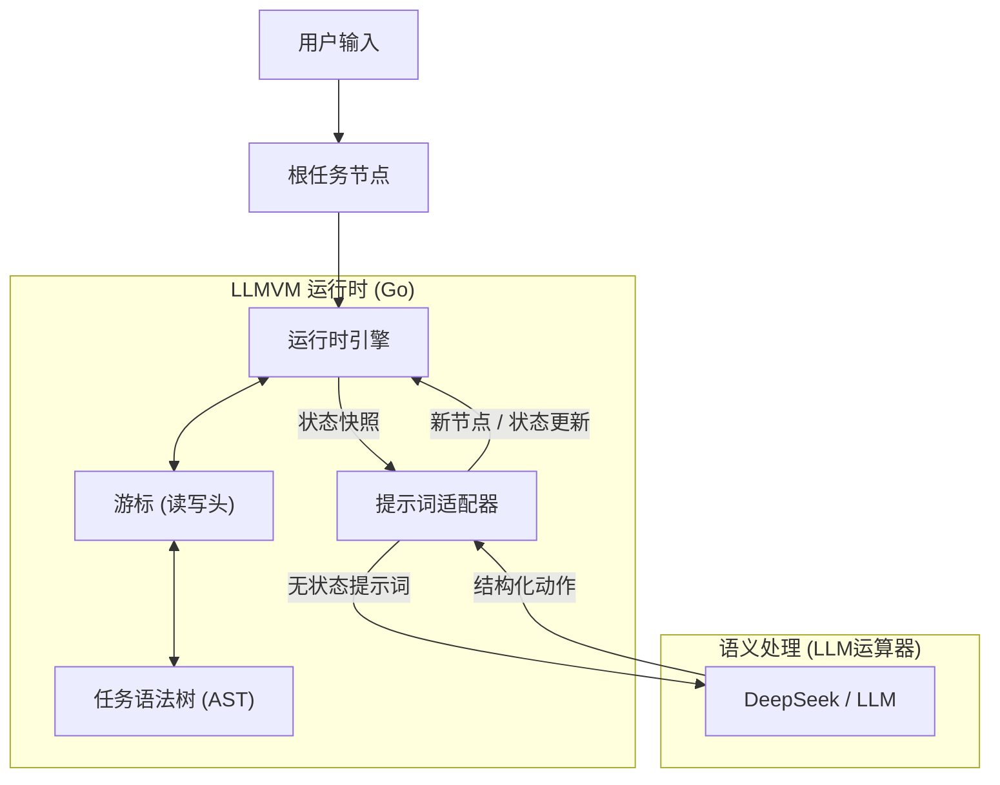

# LLMVM (LLM Virtual Machine) - 中文版

**LLMVM** 是一个先进的 Agent 运行时，它从根本上重新想象了大语言模型（LLM）执行复杂任务的方式。LLMVM 不再依赖传统的”思维链（CoT）”循环，而是作为一个语义状态机，为每个任务动态构建并执行专用的程序语法树（AST）。

## 🚀 核心亮点

*   **显式控制流结构**：不同于依赖概率循环的标准 Agent，LLMVM 实现了显式的控制流结构。
    *   **循环节点 (Loop Nodes)**：由专用运行时栈管理，确保循环逻辑忠实执行，直至满足退出条件。
    *   **DFS 执行**：使用深度优先搜索进行任务执行，模拟编译程序的调用栈，而非扁平的动作列表。

*   **无状态架构 (Stateless)**：通过绝不向模型输入完整的对话历史，解决了“上下文窗口爆炸”问题。在每一步，LLM 仅接收当前状态的精准快照。

*   **以变量为中心的全局注意力 (v9)**：一种革命性的“语义索引”机制。
    *   **选择阶段**：模型预扫描精简索引，自主决定哪些历史节点（及其变量）对当前任务有用。
    *   **执行阶段**：仅将选中的变量和结果加载进**瞬时态 RAM**，实现极高的上下文利用率。

*   **全功能 Shell 注入 (v8)**：由受限 VFS 升级为真实 Shell 执行 (`sh -c`)。
    *   **管道与重定向**：支持类似 `ls | grep .go | wc -l` 的复杂指令。
    *   **工具链感知**：AI 现可直接调用 `curl`, `find`, `go test` 等宿主环境工具。

*   **作用域节点变量 (Scoped Variables)**：遵循 DFS 生命周期的分布式内存，在保持路径特定状态的同时防止上下文污染。

*   **上下文感知叶节点**：将“叶节点”定义为大小足以完美适配 LLM 最佳上下文窗口的任务单元，通过主动拆解确保高质量推理。

*   **自主纠错 (Robustness)**：
    *   **Try-Catch 机制**：内置重试循环（默认 3 次），用于处理解析或执行失败。
    *   **错误反馈**：运行时自动捕获错误并将其反馈给 LLM，引导其自我修正。

*   **增量文件写入 (`append_to_file`)**：专用的文件追加操作，让 LLM 能够增量构建文档而无需处理 Shell 转义问题。
    *   **无需转义**：直接追加内容到文件，无缝处理特殊字符（引号、撇号等）。
    *   **树结构友好**：每个节点可以独立贡献自己的部分到共享文档。
    *   **Token 高效**：避免重写整个文件，节省上下文窗口空间。

*   **实时 Token 统计**：在每次 LLM 调用时监控上下文窗口使用情况。
    *   **使用追踪**：显示估算的 Token 数量和上下文限制的百分比（默认：DeepSeek 64K）。
    *   **自动警告**：当使用率超过 75% 或 90% 阈值时发出警报。
    *   **优化指导**：帮助识别何时需要分解任务或优化提示词。

## 🛠 架构原理

LLMVM 将 **逻辑（控制流）** 与 **语义（智能）** 分离。



1.  **TaskTree**: 存储程序状态的动态树结构。节点类型包括 `Normal`, `Loop`, 或 `Leaf`。
2.  **Cursor**: 追踪当前执行点，管理遍历和循环栈。
3.  **Stateless Prompting**: 运行时构建当前节点及其近邻的 JSON 结构化快照，最大化上下文效率。

## 📦 安装指南

```bash
git clone https://github.com/Steve65535/llmvm.git
cd llmvm
go mod download
```

### 🔑 环境变量
你需要设置 DeepSeek API key 才能使用实时引擎：
```bash
export DEEPSEEK_API_KEY="your_api_key_here"
```

## ⚡ 使用方法

使用自然语言指令运行 VM：

```bash
go run cmd/main.go "分析此项目的代码结构并突出关键架构模式"
```

或进入交互模式：

```bash
go run cmd/main.go
# 然后在提示符下输入指令
```

## 📂 项目结构

*   `cmd/`: CLI 入口。
*   `pkg/runtime/`: 核心 VM 引擎（控制器/CPU）。
*   `pkg/cursor/`: 游标逻辑与栈管理（读写头）。
*   `pkg/tasknode/`: AST 数据结构（内存/程序存储）。
*   `pkg/llm/`: LLM 接口适配器（算术逻辑单元/ALU）。

## 📄 开源协议

MIT
