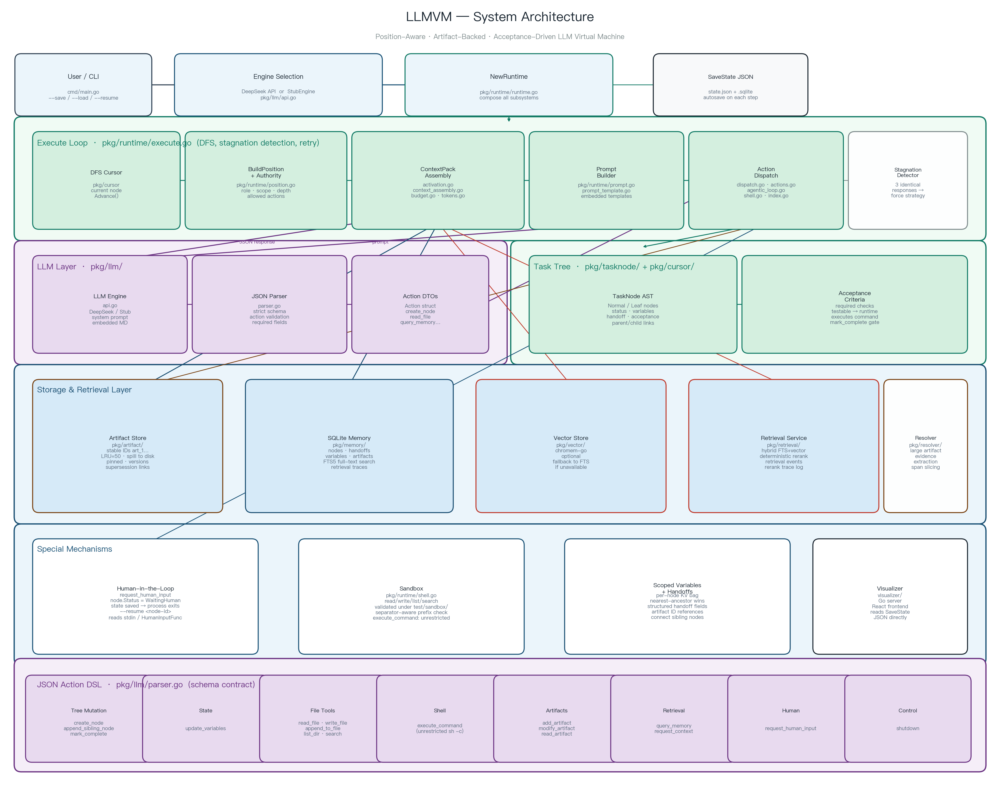
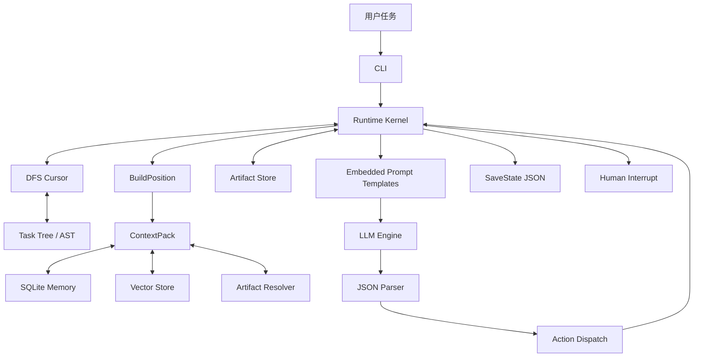

# LLMVM

**LLMVM 是一个位置感知、Artifact 驱动、验收约束的 LLM 任务程序虚拟机。**

它不是“带更多工具的聊天 Agent”。它是一个 Go runtime，用可恢复的任务树执行长任务。模型负责提出结构化动作；runtime 负责控制流、状态、证据、权限、检索和完成判定。

> 把 LLM 的上下文窗口当作 CPU 寄存器，而不是磁盘。每次模型调用只加载当前位置需要的最小充分状态。持久状态放在任务树、Artifact 和可重建索引里。

## 核心理念

常见 Agent 通常是一条不断增长的对话：

```text
用户目标 -> 模型 -> 工具 -> 观察结果 -> 追加到历史 -> 模型 -> ...
```

LLMVM 更像一台虚拟机：

```text
取当前节点
  -> 构造 Position
  -> 组装 ContextPack
  -> 调用 LLM 作为语义 ALU
  -> 解析 JSON Action DSL
  -> 校验 schema 和权限
  -> 执行动作
  -> 提交状态和 Artifact
  -> 移动 Cursor
```

关键区别是：**状态不藏在聊天历史里。状态是显式的、可序列化的、可检查的、可恢复的。**

## VM 映射

| 虚拟机概念 | LLMVM 对应物 |
|---|---|
| 程序 | Task Tree / AST |
| 指令指针 | DFS Cursor |
| Runtime / CPU | `pkg/runtime` |
| 语义 ALU | LLM Engine |
| 指令集 | JSON Action DSL |
| 寄存器 | 当前节点的 Prompt 快照 |
| 内存 | TaskNode variables / handoff |
| 证据存储 | Artifact Store |
| 查询索引 | SQLite Memory + Vector Store |
| 中断 | Human-in-the-loop |
| 权限环 | Position Authority |
| 完成契约 | Acceptance Criteria / Results |
| 持久化镜像 | SaveState JSON |
| 调试视图 | Visualizer / 未来 TUI |

## 执行模型

LLMVM 的任务程序是即时构造的。Root 节点来自用户请求。模型可以创建子节点、追加同级节点、产出 Artifact、查询 Memory、请求上下文、调用工具，并最终标记节点完成。

Runtime 才是权威：

```text
LLM 提出结构
Runtime 拥有结构
Cursor 执行结构
Artifact 保存证据
Memory 索引证据
Acceptance 验证完成
Handoff 连接节点
```

当前执行流是：

```text
CLI 启动 / 加载状态
  -> NewRuntime
  -> Execute 主循环
    -> 当前 Cursor 节点
    -> BuildPosition
    -> BuildContextPack
    -> 从内嵌 markdown 模板构造 Prompt
    -> LLM 调用
    -> ParseResponse
    -> CheckAuthority
    -> ExecuteAction dispatch
    -> 写入 TaskTree / Artifact / SQLite / Vector
    -> decideNextStep
    -> autosave hook
```

## 核心机制

### Task Tree 即程序

任务树是控制流权威。节点保存：

- 类型：`Normal` 或 `Leaf`。
- 状态：pending、running、completed、failed、waiting human。
- 作用域变量。
- 结构化 handoff。
- Artifact 引用。
- 验收标准和验收结果。
- JSON load 后可恢复的父子关系。

`Normal` 节点负责规划和协调。`Leaf` 节点负责原子执行，并可进入 agentic refinement loop，直到满足完成条件。

### 位置工程

节点不会拿到一包通用 prompt。它拿到的是由自己在任务树中的位置决定的 prompt。

`BuildPosition` 推导：

- Node ID、Parent ID、深度、路径、兄弟序号。
- Role：`root`、`planner`、`executor`、`error_handler`。
- Scope：默认可见的上下文范围。
- Authority：当前位置允许输出哪些 action。
- Constraints：例如必须满足的验收标准。

Runtime 把 `## Position` 和 `## Allowed Actions` 注入 prompt，并在执行前用 `CheckAuthority` 强制校验同一套策略。

### Context Pack

上下文由 runtime 组装，不由模型记忆。

当前 pipeline：

```text
BuildPosition
  -> buildNodeActivation
  -> retrieval.Query
  -> resolver.Resolve for large artifacts
  -> format ContextPack
```

`NodeActivation` 提供确定性上下文：

- 层级路径。
- 父节点目标。
- 兄弟 handoff。
- 可用 Artifact 索引。
- Open questions。
- Tree index。

`retrieval.Service` 提供混合检索：

- SQLite metadata filter。
- SQLite FTS。
- 可选 chromem-go vector search。
- 确定性 merge 和 rerank。
- retrieval event 与 rerank trace 记录。

`resolver.Resolver` 处理大 Artifact：只抽取和当前目标相关的证据片段，而不是把全文塞进主 prompt。

### Artifact 驱动记忆

工具结果和可复用证据默认进入 Artifact：

```text
工具输出 -> Artifact -> Artifact ID -> variables / handoff / retrieval index
```

Artifact 具有稳定 ID、摘要、来源元数据、scope、tags、granularity、importance、版本、supersedes、pin、token count 和 spill-to-disk 行为。

DSL 也支持一等 Artifact action：

- `add_artifact`：创建可复用证据单元。
- `modify_artifact`：追加新版本，并把旧 Artifact 标记为 superseded。
- `read_artifact`：按切片读取内容，避免加载全文。

变量和 handoff 应引用 Artifact ID，而不是复制大段内容。

### SQLite 与 Vector 索引

任务树是事实来源。SQLite 和 Vector 是可重建的检索镜像。

SQLite 索引：

- Nodes。
- Handoffs。
- Scoped variables。
- Artifacts 与 FTS 记录。
- Acceptance criteria / results。
- Retrieval / rerank events。

Vector 存储是可选的。不可用时 retrieval 回退到 FTS。SQLite 不可用时 runtime 也会降级，而不是丢失任务树。

### JSON Action DSL

模型必须返回一个 JSON 对象：

```json
{
  "actions": [
    {
      "action_type": "create_node",
      "node": {
        "id": "inspect_runtime",
        "name": "Inspect Runtime",
        "type": "Leaf",
        "information": "Read pkg/runtime and summarize the execution loop"
      }
    }
  ]
}
```

Runtime 会解析、校验、权限检查并 dispatch action。`ExecuteAction` 有意保留 Go switch 作为 DSL interpreter：容易阅读、容易测试，并且在副作用边界保持严格。

Action 家族包括：

- 树变更：`create_node`、`append_sibling_node`、`mark_complete`。
- 状态更新：`update_variables`。
- 工具：`execute_command`、`read_file`、`write_file`、`append_to_file`、`list_dir`、`search`。
- Artifact：`add_artifact`、`modify_artifact`、`read_artifact`。
- 检索：`query_memory`、`request_context`。
- 人类协作：`request_human_input`。
- 控制：`shutdown`。

### 验收驱动完成

Loop 节点已经从 DSL 中移除。迭代语义由 acceptance criteria 和 retry budget 表达。

节点可以定义验收标准：

```json
{
  "description": "go test ./pkg/llm passes",
  "required": true,
  "check_type": "testable",
  "check_command": "go test ./pkg/llm"
}
```

完成时必须提交 `acceptance_results`。对于 `testable`，runtime 会自己执行命令；如果真实退出码和模型自评不一致，runtime 以真实结果为准。

完成流程是：

```text
模型提出完成
  -> runtime 验证必需验收标准
  -> 写入 handoff
  -> pin / index artifacts
  -> cursor 继续推进
```

### Human-in-the-loop

`request_human_input` 是 runtime 中断：

```text
request_human_input
  -> node.Status = WaitingHuman
  -> 保存状态
  -> 用户用 --resume <node-id> 恢复
  -> 注入 HumanResponse
  -> 继续执行
```

这让人类介入成为可持久化、可恢复的执行状态，而不是一次性的终端输入。

## Runtime 包结构

`pkg/runtime` 围绕一个 `Runtime` 对象拆分：

| 文件 | 职责 |
|---|---|
| `runtime.go` | `Runtime` struct、`NewRuntime`、生命周期辅助 |
| `execute.go` | DFS 主循环、retry、stagnation、cursor 移动 |
| `dispatch.go` | Action DSL dispatch 和核心 handler |
| `position.go` | Position、role、scope、authority policy |
| `activation.go` | NodeActivation 和 ContextPack pipeline |
| `context_assembly.go` | 全局上下文、Tree index、workspace 兼容逻辑 |
| `prompt.go` | 从 runtime 状态构造 Prompt |
| `prompt_template.go` | 内嵌节点 Prompt 模板 |
| `index.go` | SQLite rebuild/sync 和 vector indexing |
| `shell.go` | Shell 执行和文件工具沙箱 |
| `actions.go` | 特殊 action：human、memory、artifact、context、acceptance |
| `agentic_loop.go` | Leaf refinement loop |
| `budget.go` | 上下文和检索预算配置 |
| `tokens.go` | token 估算、压缩、兜底 operation log |

这样 `runtime.go` 保持为 composition root，执行行为分散到职责明确的文件中。

## 架构



<details>
<summary>Mermaid 源码</summary>


```mermaid
graph TD
    User["用户任务"] --> CLI["CLI"]
    CLI --> Runtime["Runtime Kernel"]

    Runtime <--> Cursor["DFS Cursor"]
    Cursor <--> Tree["Task Tree / AST"]

    Runtime --> Position["BuildPosition"]
    Position --> ContextPack["ContextPack"]
    ContextPack <--> Memory["SQLite Memory"]
    ContextPack <--> Vector["Vector Store"]
    ContextPack <--> Resolver["Artifact Resolver"]

    Runtime <--> Artifacts["Artifact Store"]
    Runtime --> Prompt["Embedded Prompt Templates"]
    Prompt --> LLM["LLM Engine"]
    LLM --> Parser["JSON Parser"]
    Parser --> Dispatch["Action Dispatch"]
    Dispatch --> Runtime

    Runtime --> Save["SaveState JSON"]
    Runtime --> Human["Human Interrupt"]
```

</details>

## 项目结构

- `cmd/`：CLI 编排、engine 选择、状态加载/保存、信号处理、人类恢复、最终树打印。
- `pkg/runtime/`：VM kernel、执行循环、上下文组装、action dispatch、权限校验、索引、沙箱。
- `pkg/llm/`：LLM provider wrapper、内嵌 system prompt、action DTO、JSON parser。
- `pkg/tasknode/`：任务树模型、结构化 handoff、验收状态、人类请求/响应状态。
- `pkg/cursor/`：DFS cursor 和遍历状态。
- `pkg/artifact/`：Artifact store、切片、spill、pin、结构化元数据。
- `pkg/memory/`：SQLite schema、索引、受限查询、FTS、retrieval trace。
- `pkg/retrieval/`：FTS/vector 混合检索和确定性 rerank。
- `pkg/vector/`：可选 chromem-go vector index。
- `pkg/resolver/`：大 Artifact 证据抽取。
- `pkg/vfs/`：遗留虚拟文件系统代码。
- `visualizer/`：保存状态可视化服务器和前端。
- `markdown/`：设计笔记和架构实验文档。

## 配置

| 变量 | 默认值 | 说明 |
|---|---:|---|
| `DEEPSEEK_API_KEY` | 未设置 | DeepSeek API key。未设置时 CLI 回退到 `StubEngine`。 |
| `LLMVM_CONTEXT_TOKEN_LIMIT` | `200000` | 当前 runtime 使用的总 prompt 预算。 |
| `CONTEXT_BUDGET` | fallback alias | 兼容旧版本的上下文预算变量。 |
| `LLMVM_RETRIEVAL_TOKEN_LIMIT` | context limit 的一半 | retrieval 候选预算。 |
| `LLMVM_ARTIFACT_INLINE_TOKEN_LIMIT` | `6000` | 大 Artifact 内联 / resolver 证据预算。 |
| `LLMVM_ARTIFACT_ASYNC_TOKEN_THRESHOLD` | `12000` | 预留给异步 Artifact resolver 的阈值。 |
| `LLMVM_COMMAND_RESULT_CHARS` | `8000` | command / artifact slice 暴露给 prompt 的最大字符数。 |
| `LLMVM_VECTOR_DIR` | 从 save 路径派生 | 可选 chromem-go vector store 目录。 |

## 使用

安装依赖：

```bash
go mod download
```

运行任务：

```bash
go run cmd/main.go "分析这个仓库并总结架构"
```

交互模式：

```bash
go run cmd/main.go
```

保存和恢复：

```bash
go run cmd/main.go --save state.json "执行一个复杂任务"
go run cmd/main.go --load state.json
```

恢复等待人类输入的节点：

```bash
go run cmd/main.go --load state.json --resume node_id
```

启动可视化服务器：

```bash
cd visualizer
go run server.go -file ../deep_compiler.json
```

启动前端：

```bash
cd visualizer/frontend
npm run dev
```

## 开发

运行全部 Go 测试：

```bash
go test ./...
```

重点测试：

```bash
go test ./pkg/llm -v
go test ./pkg/runtime -v
go test ./pkg/artifact -v
go test ./pkg/memory -v
```

前端检查：

```bash
cd visualizer/frontend
npm run lint
npm run build
```

## 设计状态

已经实现或部分实现：

- 任务树执行。
- Position 和 authority check。
- 内嵌 prompt 模板。
- 带结构化元数据的 Artifact Store。
- SQLite Memory 和 FTS。
- 可选 Vector retrieval。
- ContextPack pipeline。
- 大 Artifact Resolver。
- Acceptance criteria 和 runtime testable check。
- Human-in-the-loop pause/resume。
- Save/load state。

仍在演进：

- 更精确的 parser diagnostics。
- ContextPack 内部更统一的预算所有权。
- 更清晰的 ContextProvider 抽象。
- manual / LLM-judge acceptance 的完整语义。
- TUI cockpit。
- Provider-level JSON/schema 输出约束。

## 许可证

MIT
