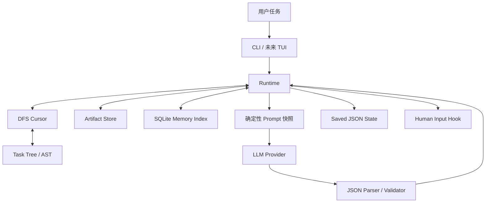

# LLMVM

LLMVM 是一个用 Go 编写的实验性 LLM 运行时。它的目标不是再做一个持续堆聊天历史的 Agent，而是把长任务执行成一棵可恢复、可检索、可观察的任务树。

核心思想是：模型每次只做一次无状态决策，真正的执行状态由 runtime 持久化管理。任务树负责控制流，Artifact 负责保存证据，SQLite Memory 负责检索索引，Prompt 每一步都从当前节点的位置重新构建。

> 把 LLM 的上下文窗口当作 CPU 寄存器，而不是磁盘。每次调用只加载当前位置需要的最小充分上下文，持久状态放在任务树、Artifact 和可重建索引里。

## 为什么需要 LLMVM

常见 Agent loop 会不断累积对话历史。任务一长，上下文就会变贵、变脏、难压缩，也很难可靠恢复。

LLMVM 走另一条路线：

- Runtime 通过显式任务树掌控控制流。
- 模型输出结构化 action，而不是把控制状态藏在自然语言里。
- 工具结果保存为带稳定 ID 的 Artifact。
- SQLite Memory 是查询索引，不是状态权威。
- JSON 状态可以保存和恢复任务树与 Artifact 元数据。
- 人类输入是原生的暂停 / 恢复状态。

因此 LLMVM 更像一个面向任务执行的虚拟机，而不是聊天机器人外壳。

## 当前能力

### 显式任务树执行

任务由 `TaskNode` 表示，并由 DFS Cursor 遍历执行。节点保存类型、状态、作用域变量、结构化 handoff、artifact 引用以及父子关系。

AST / 任务树是权威状态。SQLite Memory、Prompt 快照和可视化数据都应该从任务树派生。

### 无状态模型调用

每次模型调用都由 runtime 构造确定性快照：

- 当前节点和目标。
- 祖先路径和父节点目标。
- 兄弟节点 handoff 与 open questions。
- 作用域变量。
- Artifact 摘要和选中的检索结果。
- retry、错误、压缩等 runtime 状态。

Runtime 不依赖持续增长的聊天记录。这是恢复执行、上下文压缩和长任务运行的基础。

### 结构化 Action 协议

模型通过经过验证的 JSON action 协议与 runtime 通信。Parser 和 runtime 会验证 action，而不是只依赖 prompt 约束。

核心 action 包括节点创建 / 完成、文件工具、Artifact 读取、Memory 查询、Shell 执行、追加同级节点和请求人类输入。

修改 action 行为时必须同步更新完整路径：

- `pkg/llm/api.go`：系统提示和 action 文档。
- `pkg/llm/parser.go`：DTO 和校验。
- `pkg/runtime/`：实际执行逻辑。
- `pkg/tasknode/`、`pkg/artifact/` 或 `pkg/memory/`：需要持久化的新状态。

### Artifact Store

工具输出和可复用证据默认进入 Artifact，而不是复制进变量或 Prompt。

Artifact 支持：

- `art_1`、`art_2`、`art_3` 这样的稳定 ID。
- 用于 Prompt 展示的摘要。
- 通过 `read_artifact` 分片读取。
- 重要 Artifact 的 pin 保护。
- 活跃存储的 LRU 行为。
- 大内容磁盘 spill。
- 恢复后内容缺失时保留墓碑元数据。

变量和 handoff 应引用 Artifact ID，而不是嵌入大段内容。

### SQLite 结构化 Memory

`pkg/memory/` 维护 SQLite 检索索引，覆盖：

- 节点。
- 结构化 handoff。
- 作用域变量。
- Artifact 元数据。
- 可全文检索的 Artifact 记录。

任务树仍然是权威来源。SQLite 是可重建索引，用来提供确定、可检查、低成本的检索。模型可以通过受限的 `query_memory` 模式查询，例如祖先链、兄弟 handoff、最近 Artifact、Pinned Artifact 和 FTS Artifact 搜索。

### 结构化 Handoff

完成节点可以输出结构化 handoff：

```json
{
  "summary": "完成了什么",
  "key_facts": ["关键事实"],
  "decisions": ["重要决策"],
  "assumptions": ["未经验证的假设"],
  "outputs": ["产出的文件、值或状态"],
  "open_questions": ["下游节点需要知道的未解问题"],
  "artifact_refs": ["art_2", "art_5"],
  "handoff": "给下游节点的一句话交接",
  "confidence": "high"
}
```

这让下游节点读取紧凑、类型化的交接结果，而不是从原始历史里猜测进度。

### Runtime 保护机制

LLMVM 包含 runtime 层面的保护：

- 文件工具限制在 `test/sandbox/` 下。
- 分隔符感知的路径校验。
- 将错误反馈给模型以便自我修正。
- 检测连续相同响应导致的停滞。
- 上下文溢出时逐级压缩。
- 保存 / 加载状态。
- 配置保存路径时支持 Ctrl+C 保存。
- `WaitingHuman` 状态支持人类介入后继续执行。

Shell 执行的能力比文件工具更大。它是显式的主机级能力，和受沙箱限制的文件工具不同。

## 位置工程

`markdown/position_engineering_deep_refactor.md` 的主要方向是把“位置”提升为 runtime 的一等概念。

位置工程的含义是：节点不应该只是拿到一包通用上下文，而应该先理解：

- 自己在任务树里的位置。
- 自己在当前位置承担的角色。
- 自己负责的范围。
- 自己被允许执行哪些 action。
- 自己应该检索哪些证据。
- 完成后必须交付什么 handoff。

也就是：

```text
Position -> Context Needs -> Retrieval Plan -> Context Pack -> Decision -> Handoff
```

规划中的 runtime 概念包括：

- `Position`：节点 ID、父节点、深度、路径、兄弟序号、角色、scope、权限、约束。
- `ContextNeed`：当前位置需要知道什么。
- `ContextPlan`：查询哪些 provider、预算是多少。
- `ContextProvider`：memory、artifact、tree state、runtime state、VFS、未来的 vector store。
- `ContextPack`：排序、去重、压缩、预算裁剪后的最终上下文。
- `AuthorityDescriptor`：当前位置的 action 权限，由 runtime 强制执行。

当前代码已经具备节点激活、结构化 Memory、Artifact 和 Handoff 等基础。下一步是把位置策略显式化，而不是分散在 prompt 和辅助函数里。

## RAG 与 Artifact 路线图

`markdown/rag_artifact_position_engineering_experiment.md` 描述了一个风险更高的架构实验：从“任务树 + Prompt 拼装”推进到“任务树 + Artifact 交接 + 可检索记忆 + 可验收节点”。

规划方向包括：

- 通过 `add_artifact` action 让 Artifact 成为 DSL 一等对象。
- 在 SQLite 中保存更细粒度的 Artifact 元数据，后续接入向量索引。
- 增加混合检索：metadata filter、SQLite FTS、vector search、merge、rerank、context pack builder。
- 用全局上下文上限和相关性打包替代固定比例预算。
- 增加大 Artifact Resolver，只抽取当前节点需要的证据。
- 给节点引入 acceptance criteria 和 acceptance results。
- 未来用 retry budget + 显式验收替代结构化 Loop 节点。
- 增强 JSON 输出处理：提取 JSON、schema 校验、结构化 parse error，以及可用时的 provider JSON/schema 模式。

这部分是路线图，不等同于当前全部已实现功能。

## Terminal UI 路线图

`markdown/terminal_ui_plan.md` 计划增加一个 TUI，让长任务执行变得可观察、可介入、可恢复。

计划中的 TUI 是一个开发者驾驶舱，用于：

- 启动任务。
- 查看当前 Cursor 位置。
- 检查 AST。
- 阅读 Artifact 摘要和内容切片。
- 查看 Memory 查询结果。
- 回答 human-in-the-loop 请求。
- 跟踪 retry、上下文压缩、错误和 save/load 状态。

推荐技术栈是 Go 原生的 Bubble Tea、Bubbles、Lip Gloss 和 Glamour。TUI 是现有 CLI 的补充，不是替代。

## 架构


```mermaid
graph TD
    User["用户任务"] --> CLI["CLI / 未来 TUI"]
    CLI --> Runtime["Runtime"]

    Runtime <--> Cursor["DFS Cursor"]
    Cursor <--> Tree["Task Tree / AST"]
    Runtime <--> Artifacts["Artifact Store"]
    Runtime <--> Memory["SQLite Memory Index"]
    Runtime --> Prompt["确定性 Prompt 快照"]

    Prompt --> LLM["LLM Provider"]
    LLM --> Parser["JSON Parser / Validator"]
    Parser --> Runtime

    Runtime --> State["Saved JSON State"]
    Runtime --> Human["Human Input Hook"]
```

核心目录：

- `cmd/`：CLI 入口、参数、save/load、runtime 启动。
- `pkg/runtime/`：执行循环、Prompt 构建、action 执行、沙箱、上下文处理、Memory 同步。
- `pkg/llm/`：Provider API 类型、系统提示、Parser、校验、Engine wrapper。
- `pkg/tasknode/`：任务树模型、节点状态、变量、handoff、人类请求 / 响应、恢复辅助。
- `pkg/cursor/`：DFS 遍历和 loop 相关 cursor 状态。
- `pkg/artifact/`：Artifact Store、摘要、分片、淘汰、pin、磁盘 spill。
- `pkg/memory/`：SQLite 索引和受限检索查询。
- `pkg/vfs/`：遗留虚拟文件系统代码。
- `visualizer/`：Go 可视化服务器。
- `visualizer/frontend/`：用于检查保存状态的 Vite + React 前端。
- `markdown/`：设计笔记和实验性架构文档。该目录当前被 git 忽略。

## 安装

```bash
git clone https://github.com/Steve65535/llmvm.git
cd llmvm
go mod download
```

## 配置

| 变量 | 默认值 | 说明 |
|---|---:|---|
| `DEEPSEEK_API_KEY` | 未设置 | DeepSeek API key，用于真实模型调用。未设置时使用可用的 stub / 测试流程。 |
| `CONTEXT_BUDGET` | `64000` | 当前 runtime Prompt 组装使用的总上下文预算。 |

后续 TUI 和检索实验可能引入更多 `LLMVM_*` 变量。建议名称见 `markdown/` 里的设计文档。

## 使用

运行任务：

```bash
go run cmd/main.go "分析这个仓库并总结架构"
```

交互模式：

```bash
go run cmd/main.go
```

保存和恢复：

```bash
go run cmd/main.go --save state.json "执行一个复杂任务"
go run cmd/main.go --load state.json
```

使用保存状态启动可视化服务器：

```bash
cd visualizer
go run server.go -file ../deep_compiler.json
```

启动可视化前端：

```bash
cd visualizer/frontend
npm run dev
```

## 开发

运行全部 Go 测试：

```bash
go test ./...
```

运行重点测试：

```bash
go test ./pkg/llm -v
go test ./pkg/runtime -v
go test ./pkg/artifact -v
go test ./pkg/memory -v
```

运行前端检查：

```bash
cd visualizer/frontend
npm run lint
npm run build
```

Go 文件使用 `gofmt`。保持 runtime 行为确定：稳定排序会影响 prompt cache、可复现测试、保存状态和可视化输出。

## 设计原则

- 任务树是执行状态的权威来源。
- SQLite Memory 是可重建检索索引。
- Artifact 保存证据；变量和 handoff 保存引用。
- Parser 和 action 执行边界必须做 runtime 校验。
- 上下文应该由位置、相关性和预算决定，而不是由聊天历史惯性决定。
- 长任务必须可观察、可恢复、可检查。
- 未来 RAG / Vector 功能应通过接口接入，而不是硬编码进 runtime 控制流。

## 许可证

MIT
